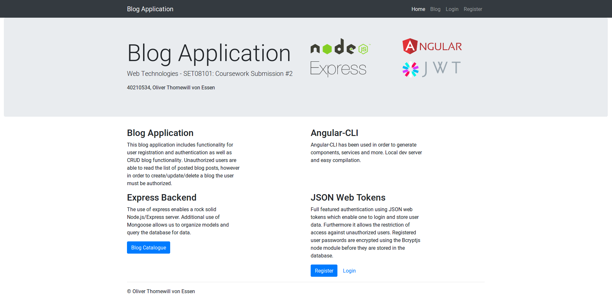

# Thornewill-Von-Essen_Oliver_set08101_coursework2
Thornewill von Essen_Oliver Coursework #2 submission

This blog application allows at least one user to create, update, delete, and read blog posts. There is an antuentication tool implemented such that only users which are authenticated are allowed to create, update, or delete posts. There is a registration and login form for the authentication.

## How to run: 
Must be in root directory of repository
```
pwd
./Thornewill-Von-Essen_Oliver_set08101_coursework2
```
Command to setup node modules and start server:
```
cd BlogApplication/ && npm install && cd angular-src/ && npm install && node ../app.js
```
This can take a couple of minutes to run. 

Final Terminal outpuut should be: 
```
Server started on  port: 3000
Connected to database mongodb://localhost/blogs
```

<p align="center">
  
</p>


### Note: 
- Node version: v8.11.0
- NPM version: 5.8.0
- I used Linux Mint 18.04 for the creation of this application

